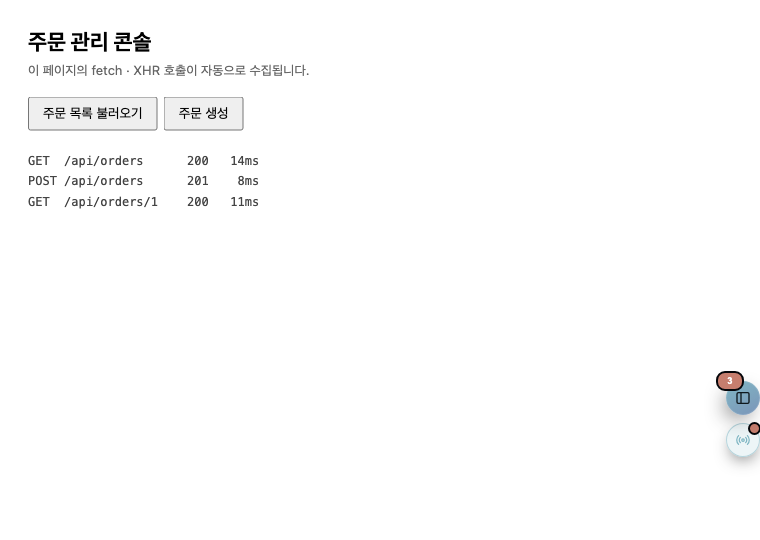
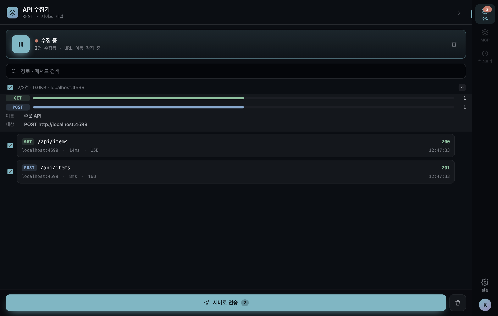
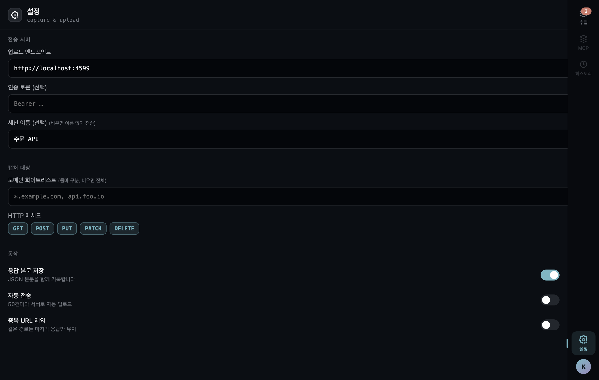

# API-to-MCP Tracker 사용 가이드 (Handoff)

브라우저의 REST API 호출을 캡처해 세션으로 모으고, 선택한 호출만 골라 백엔드로 전송해
MCP 서버로 변환하는 Chrome MV3 확장입니다. 이 문서는 빌드부터 전송까지의 핵심 사용 흐름만 다룹니다.
개발·테스트 상세는 [README](../../README.md)를 참고하세요.

## 1. 설치 — 빌드 & 로드

```bash
npm install
npm run build   # tsc --noEmit && vite build → dist/
```

1. `chrome://extensions` → 우상단 **개발자 모드** 활성화
2. **압축해제된 확장 프로그램 로드** → 저장소의 `dist/` 폴더 선택

## 2. 캡처 시작·중지

설치 직후부터 캡처가 켜져 있습니다(`trackingEnabled` 기본 ON). 페이지 우측 가장자리에
플로팅 위젯이 도킹되며, 배지 숫자가 수집 건수입니다. 위젯에 마우스를 올리면 슬라이드아웃되어
**추적 중지/시작** 칩과 **패널 열기** 버튼이 나타납니다.

위젯은 세로로 드래그해 위치를 옮길 수 있고, 옮긴 위치는 다음 방문에도 유지됩니다.



## 3. 수집 목록 확인·필터링

사이드패널의 **수집** 탭에서 캡처된 호출을 확인합니다. 행마다 method/경로/상태/소요시간이
표시되고, 검색창으로 경로·메서드를 필터링할 수 있습니다.

- **체크박스 = 전송 대상.** 기본은 전체 선택이며, 보내지 않을 호출만 체크를 해제합니다.
- **상단 요약 카드** — 전체 선택 체크박스와 함께 선택 건수·페이로드·대상 호스트가
  `N/M건 · X.XKB · host`로 한 줄에 보이고, `⌄`를 누르면 메서드 분포·세션 이름·전송 대상이 펼쳐집니다.
- 행에 마우스를 올리면(또는 키보드 포커스 시) **개별 삭제** 버튼이 나타납니다.
- 행을 클릭하면 상세 뷰에서 요청/응답 헤더·바디를 확인하고 본문·URL·cURL을 복사할 수 있습니다.



## 4. 전송

수집 탭 하단의 **서버로 전송** 버튼을 누르면 선택한 호출이 바로 전송됩니다.
세션 이름은 설정 탭에서 지정하며, 적어둔 문자열이 그대로 서버로 전달됩니다.

전송 성공 시:
- 선택한 호출들이 지정한 이름과 함께 히스토리(`sent`)로 아카이브됩니다
- **체크 해제했던 호출은 새 세션에 그대로 남아** 이어서 수집·전송할 수 있습니다
- 실패하면 `failed`로 보관되고 데이터는 유실되지 않습니다

## 5. 설정

**설정** 탭의 입력은 저장 버튼 없이 즉시 반영됩니다.

- **업로드 엔드포인트 / 인증 토큰** — 전송 대상 서버와 Bearer 키
- **세션 이름** — 전송 시 서버로 함께 보낼 이름. 가공 없이 그대로 전달되므로
  같은 이름으로 여러 번 보내면 서버에서 묶어 다룰 수 있습니다. 비우면 이름 없이 전송됩니다
- **도메인 화이트리스트** — 콤마 구분, 비우면 전체 캡처. 포트 없이 도메인만 적습니다
  (예: `localhost`, `*.example.com`)
- **HTTP 메서드** — 기록할 메서드 토글
- **동작** — 응답 본문 저장 / 자동 전송(50건 도달 시) / 중복 제거(경로 기준)



## 6. 서버 계약 (참고)

```
POST {serverUrl}/api/sessions
Authorization: Bearer {apiKey}
Content-Type: application/json

{ "sessionId": "...", "name": "...(선택)", "url": "...",
  "startedAt": 0, "endedAt": 0, "calls": ApiCall[] }
```

응답의 `{ "mcpServers": McpEntry[] }`가 확장의 MCP 목록에 병합됩니다.
`calls`에는 수집 목록에서 **선택한 호출만** 포함됩니다.

`name`은 설정에 적은 문자열이 그대로 실리고, 비어 있으면 필드 자체가 생략됩니다.

> **주의** — `calls`의 각 항목에는 `ApiCall` 타입에 없는 **`pageUrl`** 필드가 함께 실립니다
> (캡처 시점의 페이지 URL). 서버가 스키마를 엄격히 검증한다면 이 필드를 허용하거나 무시하도록
> 해야 합니다.

## 7. 알려진 제약

- 콘텐츠 스크립트 주입 **이전**(아주 이른 페이지 로드 시점)의 호출은 캡처되지 않습니다
- 재전송 UI 미구현 — `failed` 세션은 보관되지만 히스토리 뷰(disabled)가 열리기 전까지 재전송 불가.
  전송이 실패하면 해당 호출들은 목록에서도 사라집니다(아카이브로 이동)
- 세션 경계는 **30분 무활동**, **추적 토글**, 그리고 **전송**으로 결정됩니다. 전송하면 선택분이
  아카이브되고 미선택분이 새 세션으로 넘어갑니다. URL 이동(SPA·전체 페이지)은 세션을 끊지 않습니다
- 도메인 **블랙리스트**는 설정 UI에 없습니다 — 화이트리스트만 노출됩니다
